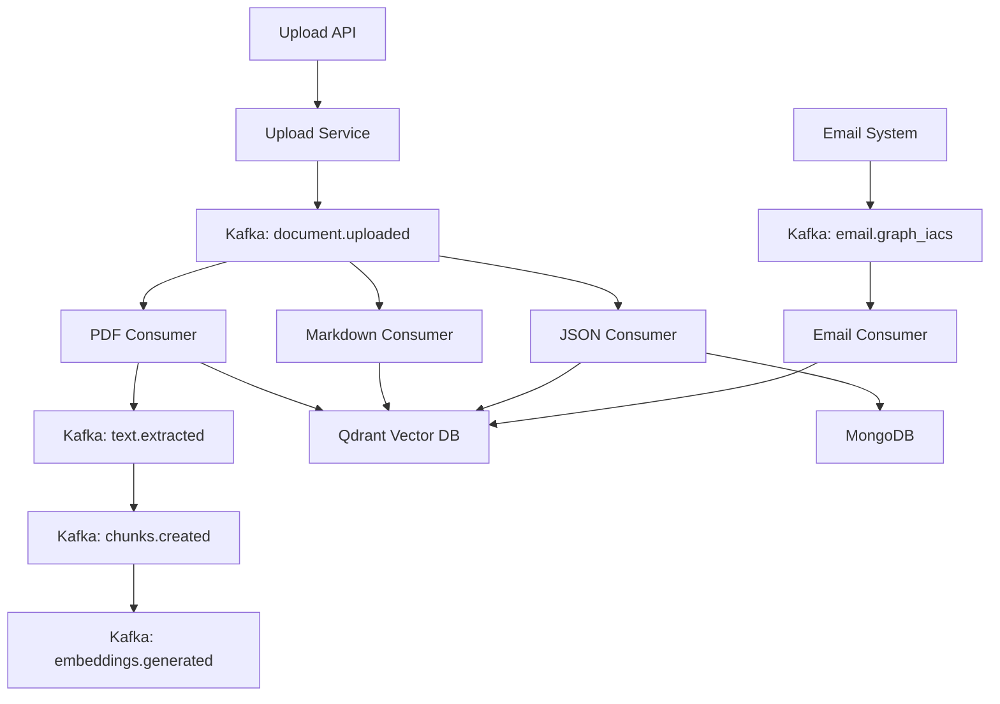

# Implementation Plan - 콘텐츠 처리 시스템

## 시스템 개요

이벤트 기반 콘텐츠 처리 시스템으로, 다양한 형식(PDF, Markdown, JSON, Email)의 콘텐츠를 처리하여 벡터DB에 저장하는 시스템입니다. API를 통한 파일 업로드와 Kafka 이벤트 기반 비동기 처리를 지원합니다.

## 데이터 파이프라인

### 전체 흐름
```
API 업로드 → 파일 검증 → 임시 저장 → 이벤트 발행(document.uploaded) → 
타입별 컨슈머 → 콘텐츠 처리 → 청킹 → 임베딩 → DB 저장 → 
처리 단계별 이벤트 발행
```

### 이벤트 타입별 처리
- `document.uploaded`: 새 문서 업로드 시 발행
- `text.extracted`: 텍스트 추출 완료 시 발행 (PDF)
- `chunks.created`: 청킹 완료 시 발행
- `embeddings.generated`: 임베딩 생성 완료 시 발행
- `email.graph_iacs`: 이메일 시스템에서 발행

## 모듈 간 상호작용



## 핵심 스키마 정의

### 1. 이벤트 입력 스키마
```python
class ContentEvent(BaseModel):
    event_type: str  # 이벤트 타입 식별자
    content_id: str  # 콘텐츠 고유 ID
    content_data: Dict[str, Any]  # 실제 콘텐츠 데이터
    metadata: Optional[Dict[str, Any]]  # 추가 메타데이터
    timestamp: datetime  # 이벤트 발생 시간
```

### 2. 처리 결과 스키마
```python
class ProcessedContent(BaseModel):
    content_id: str  # 원본 콘텐츠 ID
    original_type: str  # 원본 타입
    processed_data: Any  # 처리된 데이터
    embeddings: Optional[List[Dict[str, Any]]]  # 임베딩 결과
    metadata: Dict[str, Any]  # 처리 메타데이터
    processed_at: datetime  # 처리 시간
```

## 구현 단계

### Phase 1: 인프라 구축 (1주차)
1. **Docker 환경 설정**
   - MongoDB, Qdrant, Kafka, Zookeeper, Redis 컨테이너 구성
   - docker-compose.yml 작성
   - 네트워크 및 볼륨 설정

2. **Kafka 설정**
   - 토픽 생성 (document.uploaded, text.extracted, chunks.created, embeddings.generated, email.graph_iacs)
   - 컨슈머 그룹 설정
   - Kafka-UI 모니터링 설정

3. **데이터베이스 초기화**
   - MongoDB: iacsrag_dev 데이터베이스 및 컬렉션 생성
   - Qdrant: documents 컬렉션 생성 (vector_size: 1536)
   - Redis: 캐시 설정

4. **API 서버 설정**
   - FastAPI 앱 초기화
   - 업로드 라우터 구현
   - 미들웨어 설정

### Phase 2: 모듈 개발 (2-3주차)
1. **Upload Service 구현**
   - 파일 업로드 API 엔드포인트
   - 파일 검증 로직
   - 이벤트 발행 (document.uploaded)
   - 업로드 이력 저장

2. **각 모듈 Consumer 구현**
   - PDF Consumer (document.uploaded 구독)
   - Markdown Consumer
   - JSON Consumer
   - Email Consumer (email.graph_iacs 구독)

3. **처리 서비스 구현**
   - PDF 파서 (PyPDF2, pdfplumber)
   - Markdown 프로세서
   - JSON 파서
   - Email 파서

4. **청킹 서비스 구현**
   - 의미론적 청킹 (PDF) - LangChain 활용
   - 마크다운 청킹 - 헤더 기반
   - JSON/Email은 청킹 없음

5. **임베딩 서비스 구현**
   - OpenAI 임베딩 API 통합
   - 배치 처리 최적화
   - 재시도 로직

6. **이벤트 발행 서비스**
   - PDF 모듈: text.extracted, chunks.created, embeddings.generated
   - 다른 모듈: 필요시 이벤트 발행

### Phase 3: 통합 및 최적화 (4주차)
1. **통합 테스트**
   - API 업로드 → 처리 → 저장 전체 플로우 테스트
   - 각 콘텐츠 타입별 E2E 테스트
   - 이벤트 체인 검증

2. **모니터링 설정**
   - OpenTelemetry Trace 설정
   - 로깅 시스템 구축 (DEBUG, INFO, WARN, ERROR)
   - Kafka-UI를 통한 이벤트 모니터링

3. **성능 최적화**
   - 병렬 처리 구현 (asyncio)
   - Redis 캐싱 전략
   - 배치 처리 크기 최적화

4. **에러 처리**
   - Dead Letter Queue 구현
   - 재시도 정책 설정
   - 실패 알림 시스템

## 주요 고려사항

1. **확장성**
   - 새로운 콘텐츠 타입 추가 용이
   - 컨슈머 스케일링 지원
   - 처리 단계별 독립적 확장

2. **안정성**
   - 이벤트 기반 느슨한 결합
   - 실패한 이벤트 재처리
   - 트랜잭션 보장

3. **성능**
   - 비동기 처리
   - 배치 임베딩
   - 캐싱 활용

4. **유지보수**
   - 명확한 모듈 경계
   - 단방향 의존성
   - 네이밍 규칙 준수

## 환경별 설정

### 개발 환경 (.env.development)
- 로컬 Docker 컨테이너 사용
- 디버그 로깅 활성화
- 작은 배치 크기

### 프로덕션 환경 (.env.production)
- 관리형 서비스 사용 (Atlas, Confluent Cloud 등)
- INFO 레벨 로깅
- 최적화된 배치 크기
- 모니터링 및 알림 활성화